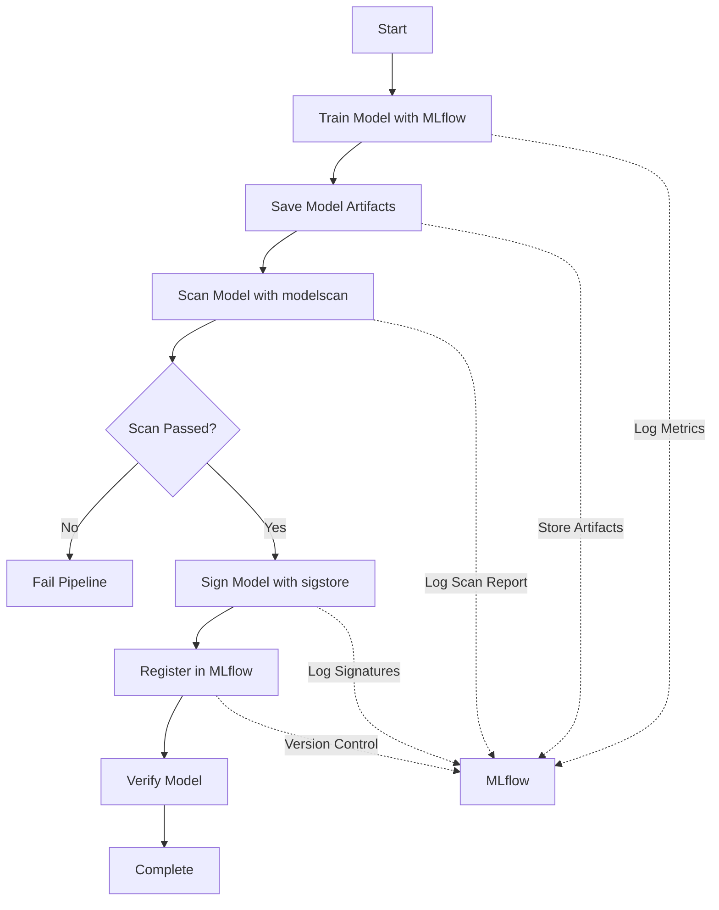

## Secure ML Pipeline Tutorial

This directory contains a complete tutorial showing how to secure a simple
Hugging Face sentiment model with:

- **MLflow** for experiment tracking
- **modelscan** for model security scanning
- **Hash-based signing** (sigstore-inspired) for integrity checks

### Scripts

- `train_sentiment_mlflow.py`: trains the IMDb sentiment model and logs
  metrics, params, and artifacts to MLflow.
- `scan_model.py`: scans a saved model directory with `modelscan`.
- `sign_model.py`: computes hashes for important model artifacts and writes
  a `.sigstore` manifest.
- `train_secure_pipeline.py`: runs training + scan + signing in one script.
- `verify_model.py`: verifies a model directory against the `.sigstore`
  manifest.

### Install dependencies

```bash
pip install "transformers[torch]" datasets accelerate mlflow modelscan
```

### Typical workflow

1. **Train with MLflow**

   ```bash
   python train_sentiment_mlflow.py
   ```

2. **Scan the saved model**

   ```bash
   python scan_model.py --model-path ./sentiment-model
   ```

3. **Sign the model artifacts**

   ```bash
   python sign_model.py --model-path ./sentiment-model --verify
   ```

4. **Run the end-to-end secure pipeline**

   ```bash
   python train_secure_pipeline.py
   ```

5. **Verify a model directory later**

   ```bash
   python verify_model.py --model-path ./sentiment-model
   ```

You can start the MLflow UI to explore runs:

```bash
mlflow ui
```

# Secure ML Pipeline Tutorial

This directory contains a complete tutorial demonstrating secure ML model training, scanning, signing, and registration using MLflow, modelscan, and sigstore.

## Overview

This tutorial shows how to build a secure ML supply chain by integrating:

1. **Model Training** with MLflow experiment tracking
2. **Security Scanning** using modelscan to detect vulnerabilities
3. **Model Signing** using sigstore for cryptographic verification
4. **Model Registry** in MLflow for versioning and deployment

## Files

- `train_sentiment_mlflow.py` - Enhanced training script with MLflow integration
- `scan_model.py` - Security scanning script using modelscan
- `sign_model.py` - Model signing script using sigstore
- `train_secure_pipeline.py` - Complete integrated pipeline
- `verify_model.py` - Model verification script

## Prerequisites

Install the required dependencies:

```bash
pip install transformers[torch] datasets accelerate mlflow modelscan sigstore
```

## Usage

### Option 1: Run Individual Steps

1. **Train the model with MLflow tracking:**
   ```bash
   python train_sentiment_mlflow.py
   ```

2. **Scan the model for security issues:**
   ```bash
   python scan_model.py --model-path ./sentiment-model
   ```

3. **Sign the model artifacts:**
   ```bash
   python sign_model.py --model-path ./sentiment-model
   ```

4. **Verify the model:**
   ```bash
   python verify_model.py --model-path ./sentiment-model
   ```

### Option 2: Run Complete Pipeline

Run the complete secure pipeline in one command:

```bash
python train_secure_pipeline.py
```

This will:
1. Train the model with MLflow tracking
2. Scan the model for security vulnerabilities
3. Sign the model artifacts
4. Register everything in MLflow

### Pipeline Options

```bash
# Skip scanning step
python train_secure_pipeline.py --skip-scan

# Skip signing step
python train_secure_pipeline.py --skip-sign

# Don't fail on scan issues (for testing)
python train_secure_pipeline.py --fail-on-scan-issues
```

## Workflow



## MLflow Integration

All scripts integrate with MLflow to track:

- **Training metrics**: Accuracy, loss, etc.
- **Hyperparameters**: Epochs, batch size, model configuration
- **Artifacts**: Model files, scan reports, signatures
- **Metadata**: Security scan status, signature status

View your MLflow runs:

```bash
mlflow ui
```

Then open http://localhost:5000 in your browser.

## Security Scanning

The `scan_model.py` script uses modelscan to detect:

- Pickle-based exploits
- Unsafe deserialization patterns
- Malicious code injection
- Other security vulnerabilities

Scan results are logged to MLflow and can be reviewed in the MLflow UI.

## Model Signing

The `sign_model.py` script uses sigstore to:

- Create cryptographic signatures for model artifacts
- Store signatures in `.sigstore/` directory
- Enable verification of model integrity

**Note**: Full sigstore signing requires OIDC authentication. The tutorial includes a simplified version for demonstration. In production, you would complete the OIDC flow.

## Model Verification

The `verify_model.py` script:

- Verifies all model signatures
- Checks file integrity using hash comparison
- Retrieves MLflow metadata
- Provides a comprehensive verification report

## Example Output

```
================================================================================
SECURE ML PIPELINE: Training → Scanning → Signing → Registration
================================================================================

MLflow Run ID: abc123def456

================================================================================
STEP 1: TRAINING MODEL
================================================================================
Loading base model and tokenizer from Hugging Face...
Downloading IMDb dataset...
Tokenizing dataset...
Starting training...
Evaluating on the test split...
Test accuracy: 0.85
✓ Training completed successfully

================================================================================
STEP 2: SECURITY SCANNING
================================================================================
Scanning model directory: ./sentiment-model
  Scanning: model.safetensors
  Scanning: config.json
  ...
✓ Security scan PASSED: 0 issues found

================================================================================
STEP 3: MODEL SIGNING
================================================================================
Signing model artifacts in: ./sentiment-model
  Signing: model.safetensors
  Signing: config.json
  ...
✓ Model signing completed and verified

================================================================================
PIPELINE COMPLETE
================================================================================
✓ Secure ML pipeline completed successfully!
```

## Next Steps

1. Explore the MLflow UI to view experiment runs
2. Check the `.sigstore/` directory for signature files
3. Review scan reports in MLflow artifacts
4. Deploy models from MLflow Model Registry

## Troubleshooting

### MLflow Connection Issues

If MLflow can't connect, it will use a local file-based backend by default. You can also start an MLflow server:

```bash
mlflow server --host 0.0.0.0 --port 5000
```

Then set the tracking URI:

```bash
export MLFLOW_TRACKING_URI=http://localhost:5000
```

### Sigstore OIDC Authentication

For production use, you'll need to complete the OIDC authentication flow. See the [sigstore documentation](https://docs.sigstore.dev/) for details.

### Model Scan False Positives

Some model files may trigger warnings that are not actual security issues. Review scan reports carefully and adjust scan settings if needed.

